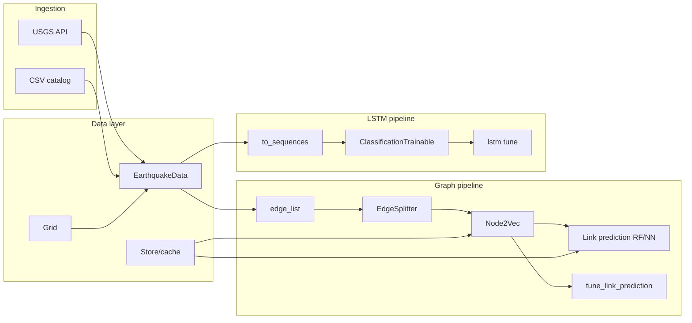

# Earthquakes pipeline – architecture

The **earthquakes** package is a CLI-driven ML pipeline for earthquake catalog data: USGS ingestion, graph-based link prediction (Node2Vec + RF/NN), and LSTM classification/regression, with Ray Tune for hyperparameter search.

## High-level data flow

## Entry point and CLI

- **Entry point:** `earthquakes/main.py` → `main()` registers a Click group and runs it. Console script: `quakes = main:main` (in `earthquakes/pyproject.toml`).
- **Subcommands:**
  - **usgs** (`data/commands.py`): `download` – fetch USGS FDSN CSV for a latitude/longitude range (string `min,max` or env `LATITUDE` / `LONGITUDE`).
  - **graphs** (`graphs/commands.py`): `edge-list`, `link-prediction`, `link-prediction-tune` – build edge list from catalog, run link prediction (RF or NN), or tune NN with Ray Tune.
  - **lstm** (`lstm/commands.py`): `tune` – download USGS data, build `EarthquakeData` (optionally with Grid/network features), run Ray Tune for LSTM classification.

## Data layer

- **EarthquakeData** (`data/data.py`): Wraps a raw catalog DataFrame. Cleans (numeric coercion, magnitude/time filters, optional delta column), normalizes (e.g. StandardScaler), and provides `data`, `normalized_data`, `to_sequences()`, `split()`, `categorical()` for binned targets. Uses `Grid` when provided to assign `node` per row. Does not mutate `self.features`; uses internal `_features_used` when delta is added.
- **Grid** (`data/grid.py`): Spatial binning. Built from validated **GridConfig** (Pydantic). Given (lat, long) bounds and cell size in km, provides `to_node()`, `apply_node()`, `to_coordinate()`, and grid geometry.
- **Store** (`data/store.py`): Disk cache under `cache/<cache_name>/`. Saves/loads by file name; supports JSON, YAML, and pickle. Uses specific exceptions and `isinstance` checks.
- **USGS** (`data/usgs.py`): FDSN event query client. Takes (min_lat, max_lat), (min_lon, max_lon); `download()` returns CSV (cached by query hash under `csv/`). Uses `eventtype` and specific exception handling.

## Config and validation

- **config.py**: Pydantic models – `RunConfig` (latitude, longitude, output_dir, seed), `USGSQueryParams`, `GridConfig`, `CoordinateBounds`, and `_parse_tuple()` for `"min,max"` strings.
- **settings.py**: `load_run_config()` and `read_coordinates()` build validated config from env (and optional overrides); coordinates are `tuple[float, float]`.

## Graph pipeline

- **Edge list:** `graphs edge-list` reads a catalog CSV, builds `EarthquakeData` + `Grid`, writes sequential edges `(nodes[:-1], nodes[1:])` to `csv/edges_<distance>_<hash>.csv`.
- **EdgeSplitter** (`graphs/edge_splitter.py`): Train/test split of edges (positive + negative sampling); seed ≥ 0 supported for reproducibility.
- **Node2Vec** (gensim) + **HadamardEmbedder**: Embed node pairs; embeddings cached via Store.
- **Link prediction:** RF (`link_prediction.py`) or NN (`link_prediction_nn.py`) on edge embeddings. **Tune** (`link_prediction_tune.py`): embedding data passed via `tune.with_parameters`, `RunConfig(name=...)`, `max_concurrent_trials=2`; outputs under `plots/<file_stem>/`.

## LSTM pipeline

- **BaseLSTMTrainable** (`lstm/trainable/base.py`): Shared base for LSTM Ray trainables. Handles training loop, early stopping, checkpointing.
- **ClassificationTrainable** (`lstm/classification/`): Ray Trainable for quantile-binned targets. Builds sequences from `EarthquakeData.categorical()` + `to_sequences()`, reports loss/accuracy.
- **RegressionTrainable** (`lstm/regression/`): Ray Trainable for continuous forecasting. Same data/split pattern, MSE/Huber/MAE/MAPE loss.
- **lstm tune** (`lstm/commands.py`): Downloads USGS, builds `EarthquakeData` (optional Grid/network features), runs Tuner. Use `--task classification` or `--task regression`; saves results and qdata under `plots/<qdata.hash>/`.

## Output and dependencies

- **Output paths:** Unified under `plots/` (LSTM and graph tune). Config can override via `RunConfig.output_dir` / env.
- **Dependency management:** `earthquakes/pyproject.toml` + `earthquakes/uv.lock`; install with `cd earthquakes && uv sync`. Dev deps: pytest, ruff. Legacy `setup.py` kept with a note; `requirements.txt` removed in favor of pyproject.
